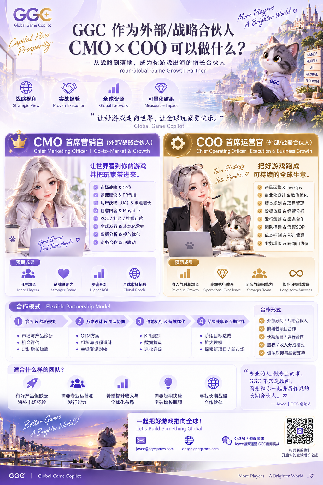
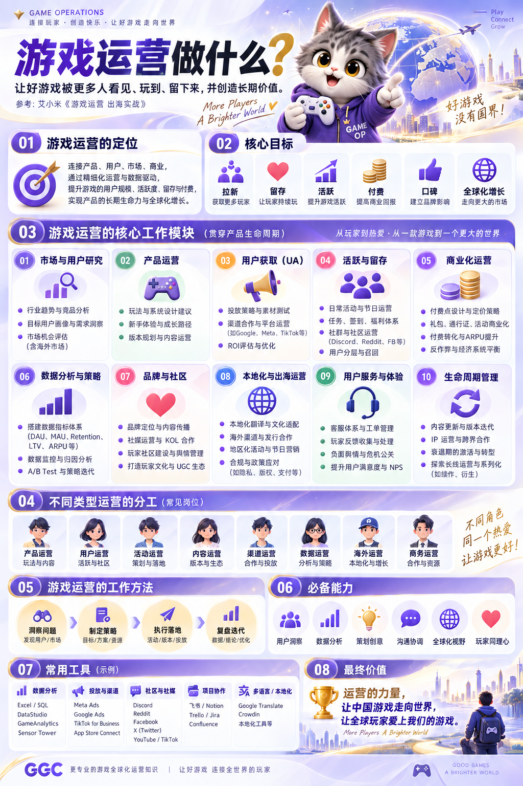

# GGC 中文业务与运营素材｜2026-09-14

Joyce 提供并批准归档的两张原图。PNG，均为 1024 × 1536；未改图、未重绘、未压缩。本次是素材归档，不表示已向客户发送或在社交平台发布。

## 1. 合作服务介绍

文件：[GGC_External_Strategic_Partner_CMO_COO_CN.png](partnership/GGC_External_Strategic_Partner_CMO_COO_CN.png)

主题：GGC 作为外部／战略合作伙伴，CMO × COO 可以做什么。

适用对象：游戏公司创始人、高管、发行负责人及项目合作方。适用场景：业务介绍、已有兴趣后的合作说明、服务资料附件。

关键词：全球发行、GTM、UA、PR、LiveOps、商业化、数据体系、团队与经营管理。

使用提醒：原图保留 joyce@ggcgames.com。后续用于外联附件前需确认该收件地址的可用性；归档不改变目前外发使用 Gmail 的安排。图中的预期成果与合作形式是介绍，不是对具体客户的收益保证或已签订条款。

## 2. 游戏运营知识

文件：[GGC_Game_Operations_Overview_CN.png](game-operations/GGC_Game_Operations_Overview_CN.png)

主题：游戏运营做什么。

适用对象：研发团队、产品与运营人员、培训学员，以及希望了解运营职能的项目负责人。适用场景：知识分享、课程介绍、公众号／社群配图、业务沟通补充资料。

关键词：市场研究、产品运营、用户获取、活跃留存、商业化、数据分析、品牌社区、本地化、用户体验、生命周期管理。

## 文件校验

|文件|SHA-256|
|---|---|
|GGC_External_Strategic_Partner_CMO_COO_CN.png|2712158d5c6cd5d6d91d76017dad2f56948211e2ef514b71e430c42f665e3869|
|GGC_Game_Operations_Overview_CN.png|2364ad42c9f109e757c60d5784e61461379b71be09ce653b22061849f969c3c6|

## 业务入口

https://opsgo.ggcgames.com/store

https://opsgo.ggcgames.com/joyce

微信／手机：17701087579

公众号／知识星球：Joyce游戏运营、GGC出海实战
