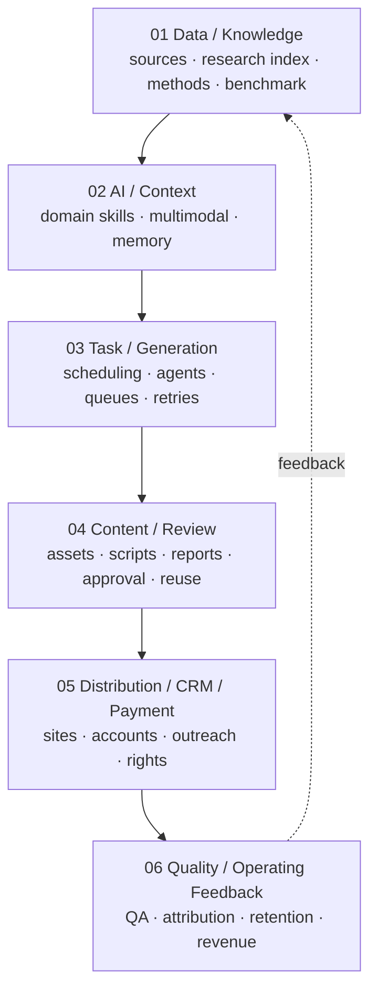

# Joyce Operating OS Tree

> Version: 2026-10-08  
> Purpose: convert Joyce's 10+ years of global game operating experience into a structured executive operating system.

## 0. Root Objective

**Build category-leading products with evidence, operating leverage, and long-term compounding.**

Joyce OS is not a tool stack and not a generic consulting process.

It is a **decision-and-operating system** for answering:

- What is worth doing?
- What evidence is good enough to keep investing?
- Where is the real bottleneck?
- What should change first?
- How should product, publishing, LiveOps, data, organization, and capital connect?
- Which capabilities should become reusable assets after the project?

---

# 1. The Tree

```mermaid
flowchart TB
    ROOT["JOYCE OPERATING OS<br/>Global products · Real evidence · Compounding capability"]

    ROOT --> S["A. SENSE / 洞察"]
    ROOT --> J["B. JUDGE / 判断"]
    ROOT --> V["C. VALIDATE / 验证"]
    ROOT --> G["D. GLOBALIZE / 全球化"]
    ROOT --> O["E. OPERATE / 经营"]
    ROOT --> R["F. ORGANIZE / 组织"]
    ROOT --> C["G. COMPOUND / 复利"]

    S --> S1["Market"]
    S --> S2["Player"]
    S --> S3["Category"]
    S --> S4["Competition"]
    S --> S5["Cycle / timing"]

    J --> J1["Where to play"]
    J --> J2["What to build"]
    J --> J3["Business model"]
    J --> J4["Resource allocation"]
    J --> J5["Go / No-Go"]

    V --> V1["Idea"]
    V --> V2["Demo"]
    V --> V3["Market signal"]
    V --> V4["Retention signal"]
    V --> V5["Revenue signal"]

    G --> G1["Positioning"]
    G --> G2["Creative"]
    G --> G3["UA / channels"]
    G --> G4["Soft launch"]
    G --> G5["Market expansion"]

    O --> O1["LiveOps"]
    O --> O2["Economy"]
    O --> O3["Retention"]
    O --> O4["Monetization"]
    O --> O5["ROI / portfolio"]

    R --> R1["People"]
    R --> R2["Decision rights"]
    R --> R3["Cross-functional cadence"]
    R --> R4["Partner model"]
    R --> R5["Turnaround"]

    C --> C1["Data"]
    C --> C2["Benchmarks"]
    C --> C3["Methods"]
    C --> C4["Content / IP"]
    C --> C5["Tools / workflow"]
```

---

# 2. Seven Operating Layers

## A. SENSE / 洞察

### Executive question
**What is actually happening, and what matters?**

### Inputs
- Market size / trend / regulation
- Player needs and behavior
- Category structure
- Competitor products and business models
- Creative / channel signals
- Historical benchmark and cycle context

### Output
A **decision-grade view**, not a news summary.

### Joyce distinction
The value is not "more information"; it is identifying **which signal changes the decision**.

---

## B. JUDGE / 判断

### Executive question
**Where should we place the bet?**

Five judgments:

1. **Category judgment** — Is the category structurally attractive?
2. **Product judgment** — Is the core player fantasy / loop strong enough?
3. **Business judgment** — Can value creation and monetization coexist?
4. **Organization judgment** — Can this team actually execute the thesis?
5. **Timing judgment** — Is this the right moment to invest?

### Output
- Priority
- Risk
- Resource recommendation
- Go / No-Go / Reframe

---

## C. VALIDATE / 验证

### Core rule
**A demo is not proof. A metric is not proof unless it answers the right question.**

Validation chain:

### Typical evidence
- Qualitative player signal
- Creative / CTR signal
- CPI / acquisition quality
- D1 / D7 / return reason
- Payer behavior
- ARPU / ARPI / LTV
- Contribution margin / payback / ROI

### Gate logic
Every stage answers **one primary question**.  
Do not use a downstream metric to hide an upstream problem.

---

## D. GLOBALIZE / 全球化

Globalization is not translation.

It combines:

- Market selection
- Positioning
- Product adaptation
- Creative language
- UA strategy
- Channel mix
- Platform / policy readiness
- Soft-launch logic
- Pricing / monetization expectations
- Local operating rhythm

### Joyce rule
**Globalization starts at product definition, not after the build is finished.**

---

## E. OPERATE / 经营

The operating layer turns a product into a business.

### Five operating loops
1. **Player loop** — Why do people come back?
2. **Content loop** — What is renewed and at what cadence?
3. **Economy loop** — Where is value created / consumed?
4. **Monetization loop** — Why and when do users pay?
5. **Learning loop** — What does each release teach us?

### LiveOps is not
- an event calendar
- a list of promotions
- a pile of notifications

### LiveOps is
**a recurring system that creates reasons to return, spend, compete, collect, express, or connect.**

---

## F. ORGANIZE / 组织

Joyce OS adapts to company scale.

| Organization | Primary problem | Operating emphasis |
|---|---|---|
| Large public company | complexity, silos, slow decision loops | decision rights, cross-functional alignment, portfolio economics |
| Scale-up / black-horse company | scaling faster than systems mature | priorities, repeatability, hiring, operating cadence |
| Startup | too many unknowns, too little capital | validation, focus, founder decisions, speed |
| Turnaround | broken continuity, lost data / team / revenue | asset salvage, operating truth, restart sequence |

### Key principle
**The same operating principle can require a different organizational implementation.**

---

## G. COMPOUND / 复利

Every meaningful project should leave behind reusable assets.

### Reusable asset classes
- Market / category research
- Benchmarks
- Decision framework
- KPI model
- Templates
- Case library
- Content / creative library
- Partner network
- Internal tooling
- AI workflow
- Operating review archive

### Rule
**Do the work once; preserve the learning so the next decision starts from a higher baseline.**

---

# 3. Category Adapters

Joyce OS is a common operating core with category-specific adapters.

## Casino / Social Casino

Focus:
- Economy depth
- Payer segmentation
- VIP value
- event cadence
- content / machine cadence
- ARPI / LTV / payback
- creative-market fit

## Arcade / Casual

Focus:
- 3-second comprehension
- core action
- immediate reward
- creative portability
- CPI
- repeatable level / content supply
- scale efficiency

## Sims / Cozy

Focus:
- identity / role fantasy
- day-7 progression
- content depth
- collection / decoration / relation loops
- content production load
- LiveOps extensibility

## AI Consumer / Relationship / Wellness

Focus:
- repeated return reason
- trust
- personalization
- memory / continuity
- subscription value
- content / community flywheel
- healthy product boundaries

---

# 4. The Six-Layer Private Infrastructure

This section maps the 2026-10-04 Private AI / OS source material into the operating system.

This is **infrastructure behind the work**, not a claim that one unified SaaS platform is fully complete.

---

# 5. Decision Gates

## Gate 0 — Worth attention?
Do we understand the category, player, business model, and why now?

## Gate 1 — Worth prototyping?
Is there a strong enough player promise / hook to test?

## Gate 2 — Worth producing?
Does the prototype produce a credible user or market signal?

## Gate 3 — Worth launching?
Can the experience support real retention and operating depth?

## Gate 4 — Worth scaling?
Can unit economics and organization support scale?

## Gate 5 — Worth compounding?
What becomes a reusable asset for the next product / team / category?

---

# 6. Operating Review Template

Every executive review should answer:

### 1. What changed?
Only material changes.

### 2. What is the strongest evidence?
Not opinions.

### 3. What is still unknown?
Explicitly name the uncertainty.

### 4. What is the bottleneck?
One bottleneck, not twenty symptoms.

### 5. What decision is required?
Owner + date + options.

### 6. What happens next?
A testable milestone.

---

# 7. What Joyce OS Is Not

- Not a growth-hacking checklist.
- Not a pile of AI tools.
- Not a fixed formula applied to every genre.
- Not a substitute for a strong product team.
- Not "consulting theatre".
- Not a promise that every project will win.

It is a structured way to **see the right problem earlier, make a higher-quality decision, and compound the learning after execution**.
