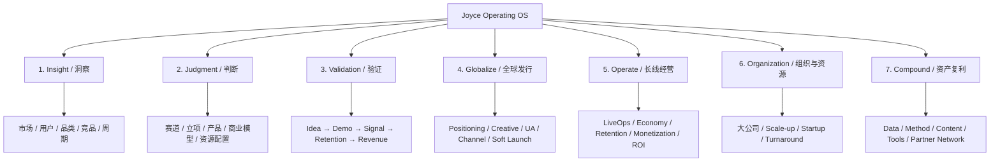

# Joyce Operating System / GGC Executive Framework

> Version: 2026-10-08  
> Status: source-of-truth for Joyce/GGC operating methodology, executive sharing, PR positioning, and future visual generation.

## Positioning

Joyce / GGC is **not positioned as a generic outsourced service vendor**.  
The core identity is:

- Global game industry insight expert
- Strategic operator with repeated global top-tier results
- Cross-category / cross-organization operating architect
- Founder-facing Copilot for important product and business decisions
- AI-native builder who is still operating products in the arena

GGC = **Global Game Copilot**.

Current brand-language candidate:

**GLOBALIZE · GAMIFY · CONNECT**

The public narrative should consistently answer five questions:

1. Who is Joyce?
2. What has Joyce already proven?
3. What does GGC actually do?
4. Why should a founder / CEO / VP / SVP bring an important problem to Joyce?
5. What is Joyce / GGC building next?

## System Overview

The user-facing principle is simple:

**Do not confuse output with evidence. Do not scale before the evidence is good enough.**

## Documents

- [JOYCE_OPERATING_OS_TREE.md](./JOYCE_OPERATING_OS_TREE.md)  
  Full operating tree, decision gates, category/organization adapters, and six-layer private infrastructure.

- [GGC_PRINCIPLES.md](./GGC_PRINCIPLES.md)  
  12 operating principles used for decisions, collaboration, internal product work, and external positioning.

- [GGC_EXECUTIVE_EMBA_FRAMEWORK.md](./GGC_EXECUTIVE_EMBA_FRAMEWORK.md)  
  Executive / EMBA-style curriculum architecture for founders, CEOs, studio heads, VP/SVP, and senior operators.

- [JOYCE_PROPRIETARY_PLAYBOOK.md](./JOYCE_PROPRIETARY_PLAYBOOK.md)  
  Joyce's proprietary operating heuristics: how to judge categories, projects, validation, publishing, LiveOps, organization, and AI-native operating leverage.

- [CLOSED_DOOR_DECK_MASTER.md](./CLOSED_DOOR_DECK_MASTER.md)  
  Locked 29-page content spine for the current closed-door executive sharing deck.

- [VISUAL_GENERATION_QA.md](./VISUAL_GENERATION_QA.md)  
  Mandatory page-by-page QA checklist for all future poster / PDF / deck image generation.

## Evidence Boundaries

Three kinds of material must always be separated:

1. **Historical operating achievements**  
   Joyce's past project / organization / category results.

2. **External client / partner outcomes**  
   Results tied to specific projects, with scope and attribution kept accurate.

3. **Current self-owned products**  
   Research, prototypes, historical tests, launches, and commercial validation must be labeled by stage.

Do not turn one category into another.

## Public / Closed-door / Paid / Internal Boundary

| Layer | Can show | Do not fully expose |
|---|---|---|
| Public PR | identity, track record, selected cases, category views, current products, vision | detailed formulas, thresholds, client-sensitive data |
| Closed-door executive sharing | deeper cases, before/after, operating architecture, selected benchmarks | full SOP, proprietary scoring logic, private deal data |
| Paid engagement | diagnosis, custom framework, project-specific decision path, review outputs | client-confidential cross-project data |
| Internal | full methodology, data lineage, prompts, thresholds, workflow implementation, access details | never publish by default |

## Core Narrative

**Global top-tier experience → repeatable judgment → still operating in the field → self-owned products → larger connection and experience space → selected external collaboration.**

The purpose of the system is not to look complicated.

The purpose is to make high-quality judgment **repeatable, teachable, and compounding**.

- [PITCH_IMAGE_SEQUENCE_29.md](./PITCH_IMAGE_SEQUENCE_29.md)  
  Locked 29-image sequence, 01–12 progress ledger, and next-page rule.

- [PITCH_IMAGE_SEQUENCE_29_v2.md](./PITCH_IMAGE_SEQUENCE_29_v2.md)  
  Corrected 29-page poster sequence, revised 09–16, continued 17–29, and dated visual/evidence QA. (Assets are conversation downloads; GitHub ledger is text only.)
