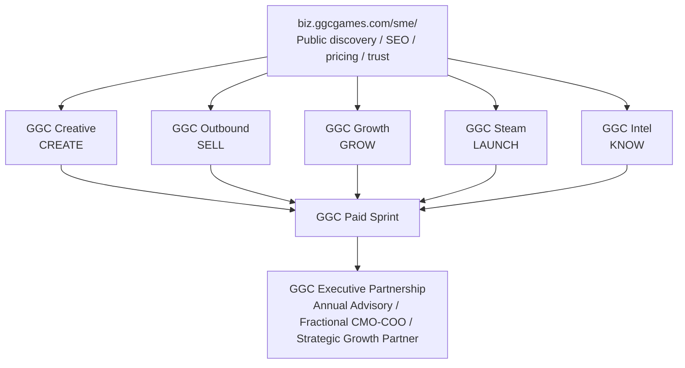

# GGC 5 Apps Mobile Build Pack v1

**Version:** 1.0  
**Date:** 2026-09-22  
**Status:** Canonical product architecture for the five mobile apps  
**Public website:** https://biz.ggcgames.com/sme/

> Product rule: **Website can be rich. Mobile must be small and beautiful.**  
> The canonical five products are fixed: **GGC Creative / GGC Outbound / GGC Growth / GGC Steam / GGC Intel**.

---

## 1. 总体产品架构图



### 产品层与能力层

**Customer-facing layer — five separate mobile products**
- GGC Creative
- GGC Outbound
- GGC Growth
- GGC Steam
- GGC Intel

**Reusable capability layer**
- Base44 app runtime / auth / entities / integrations
- ChatGPT reasoning, research and synthesis
- Codex data processing, QA, code and automation
- Telegram / agent notification workflows
- GGC category knowledge, benchmarks, research ledgers and methods

**Phase 1 architecture rule:** five apps may keep separate Base44 data stores, but use the same naming conventions, event taxonomy and UX system. Do **not** block v1 waiting for a unified backend.

**Phase 2:** central account context, entitlements, shared company profile and reusable intelligence APIs.

---

## 2. 五个产品 PRD 摘要

| App | One Job | Primary user | Core input | Core output | Primary monetization |
|---|---|---|---|---|---|
| **GGC Creative** | What should I test next? | UA / creative / growth teams, small studios, agencies | Product URL, ads, screenshots, competitor refs, brief | Angles, hooks, scripts, storyboard, test matrix, learning loop | Audit + Pro subscription |
| **GGC Outbound** | Who should I contact today? | B2B founders, BD, sales, agencies | ICP, offer, market, account criteria | Qualified accounts, decision makers, sequences, follow-ups, pipeline | Team subscription |
| **GGC Growth** | What is blocking growth? | Game/App founders, PMs, operators, growth teams | Store URL, KPIs, retention, revenue, UA, funnel | Growth Health Score, diagnosis, benchmarks, Top 5 Actions | Audit + Pro subscription + Sprint |
| **GGC Steam** | What must I do before launch? | Indie / AA game teams, publishers | Steam page, wishlist, demo, trailer, launch date | Launch score, store fixes, creator list, festival plan, weekly checklist | Audit + launch plan |
| **GGC Intel** | What changed and what does it mean? | Founders, strategy, product, investors, operators | Vertical / watchlist / company list | Daily brief, competitor moves, market signals, opportunity score, next move | Subscription |

---

## 3. 五个产品页面树

### GGC Creative

```text
Home / Ideas
├── Today
├── Winning Angles
├── Recent Tests
└── Start New Brief

Create
├── Product / Offer Context
├── Creative Audit
├── Angle Generator
├── Hook Lab
├── Script Builder
└── Storyboard / Asset Prompt

Tests
├── Test Matrix
├── Variants
├── Hypothesis
├── Status
└── Result / Learning

Library
├── Concepts
├── Hooks
├── Scripts
├── Storyboards
└── Assets

Insights
├── Winners
├── Losers
├── Pattern Learning
└── Next Tests

More
├── Workspace
├── Brand / Product Context
├── Integrations
├── Subscription
└── Settings
```

### GGC Outbound

```text
Leads
├── Today
├── High Intent
├── Qualified
└── Watchlist

Accounts
├── Company
├── Signals
├── Fit Score
└── Decision Makers

Campaigns
├── Sequence
├── Personalization
├── Send / Queue
└── Reply State

Tasks
├── Follow-ups
├── Meetings
└── Reminders

Pipeline
├── New
├── Contacted
├── In Conversation
├── Qualified
└── Won / Lost
```

### GGC Growth

```text
Home
├── Growth Health Score
├── KPI Changes
└── Top 5 Actions

Diagnose
├── FTUE
├── Retention
├── Monetization
├── LiveOps
├── UA
├── ASO
└── Market / Competitor

Actions
├── Priority
├── Expected impact
├── Owner
├── Deadline
└── Status

Benchmarks
├── Category
├── Competitors
└── KPI Reference

History
├── Previous Audits
├── KPI snapshots
└── Action Results
```

### GGC Steam

```text
Home
├── Launch Countdown
├── Wishlist Score
└── Launch Checklist

Store
├── Capsule
├── Copy
├── Screenshots
├── Trailer
└── Demo

Wishlist
├── Trend
├── Sources
└── Goal Gap

Creators
├── Discovery
├── Fit Score
├── Outreach
└── Status

Festivals
├── Calendar
├── Fit
└── Submission Status

Launch
├── Weekly Plan
├── Press
├── Influencers
└── Go-Live Checklist
```

### GGC Intel

```text
Home
├── Daily Brief
├── Top Signals
└── Opportunity Score

Trends
├── Market
├── Ads
├── Products
├── Hiring
└── Funding / M&A

Competitors
├── Watchlist
├── Moves
└── Timeline

Opportunities
├── Score
├── Why Now
├── Entry Path
└── Risks

Saved
├── Companies
├── Signals
├── Verticals
└── Briefs
```

---

## 4. 每个产品核心功能模块

### GGC Creative
1. Product / brand context ingestion
2. Creative audit
3. Angle / hook ideation
4. Script generation
5. Storyboard / production prompt
6. Variant builder
7. Test matrix
8. Result logging
9. Pattern learning
10. Export / handoff

### GGC Outbound
1. ICP builder
2. Company discovery
3. Account fit scoring
4. Decision-maker discovery
5. Signal enrichment
6. Personalization
7. Sequence generation
8. Follow-up queue
9. CRM pipeline
10. Outcome / response learning

### GGC Growth
1. KPI ingestion
2. Product/store review
3. FTUE diagnostic
4. Retention diagnostic
5. Monetization diagnostic
6. LiveOps diagnostic
7. UA / creative diagnostic
8. ASO / store diagnostic
9. Benchmarking
10. Top 5 prioritized actions

### GGC Steam
1. Steam page audit
2. Wishlist score
3. Capsule / trailer / screenshot review
4. Demo readiness
5. Creator discovery
6. Festival calendar
7. Press / influencer list
8. Launch countdown
9. Weekly launch actions
10. Post-launch review

### GGC Intel
1. Source / watchlist configuration
2. Feed ingestion
3. Entity normalization
4. Signal detection
5. Competitor timeline
6. Trend clustering
7. Opportunity scoring
8. Daily / weekly brief
9. “What this means for you”
10. Alerts / saved intelligence

---

## 5. 每个产品底部导航

| App | Tab 1 | Tab 2 | Center / Primary | Tab 4 | Tab 5 |
|---|---|---|---|---|---|
| **Creative** | Ideas | Library | **Create** | Tests | Insights |
| **Outbound** | Leads | Accounts | **Campaign** | Tasks | Pipeline |
| **Growth** | Home | Diagnose | **Actions** | Benchmarks | History |
| **Steam** | Home | Store | **Launch** | Creators | Festivals |
| **Intel** | Home | Brief | **Trends** | Competitors | Saved |

### Mobile UX rules
- Max 5 bottom tabs.
- One primary task per screen.
- No desktop tables as default mobile interaction.
- Long analysis collapses into cards; tap to expand.
- Voice input may be supported where useful, but never force a spreadsheet/form-like interaction.
- First useful output should appear within **3 minutes** for a new user.
- Every recommendation must have a visible **Why / Evidence / Next Action**.
- Every app must support share/export of its key result.
- No “dashboard for dashboard’s sake.”

---

## 6. 每个产品首页结构

### Creative — “What should I test?”
1. Greeting + active product
2. **Start New Brief** primary CTA
3. 3 Winning Angles
4. Current Test Matrix
5. Recent Creative Results
6. AI recommendation: “Test this next”

### Outbound — “Who should I contact today?”
1. Today’s qualified lead count
2. High-intent accounts
3. Decision makers
4. Follow-ups due
5. Pipeline health
6. **Start Outreach** CTA

### Growth — “What is blocking growth?”
1. Growth Health Score
2. D1 / D7 / payer / revenue / UA delta cards
3. Top 3 diagnosis alerts
4. **Top 5 Actions This Week**
5. Previous audit comparison
6. **Run New Diagnosis** CTA

### Steam — “What must I do before launch?”
1. Launch countdown
2. Wishlist Score
3. Launch Checklist
4. This Week
5. Creator / festival reminders
6. **Plan This Week** CTA

### Intel — “What changed?”
1. Daily Brief
2. Top 5 signals
3. Competitor moves
4. Opportunity Score
5. “What this means for you”
6. **Save / Alert / Explore** actions

---

## 7. Base44 实施顺序

### Phase 0 — Shared product system
Build once, reuse everywhere:
- GGC design tokens
- mobile app bar
- bottom nav
- cards / score ring / action list / signal list
- auth states
- workspace selector
- subscription / beta gate pattern
- event taxonomy
- empty / loading / error states
- source / evidence component

### Phase 1 — GGC Creative reference app
**Source system:** FlowMedia AI  
**Approach:** do not simply rename the current Bunny Studio / content factory. Port reusable engine patterns and rebuild the user-facing mobile IA.

Reuse:
- Base44 Core InvokeLLM pattern
- GenerateImage integration
- GenerationJob pattern
- Content / Variant / Asset concepts
- Create Studio generation logic
- Content Library
- Analytics learning loop
- Publisher capability mapping

Rebuild:
- product context instead of character context
- performance creative instead of generic social content
- audit → angle → hook → script → storyboard → test matrix
- mobile-first app shell
- result feedback loop

### Phase 2 — GGC Outbound
**Source system:** GGC DealGraph  
Keep the data model and mature pipeline logic; hide investment/deal complexity from the customer product.

### Phase 3 — GGC Growth
**Source systems:** GamePulse AI + OmniCritique AI  
Merge into one new app. Use one score and one prioritized action model.

### Phase 4 — GGC Steam
**New Base44 app.**  
Reuse GGC components, research patterns and outbound creator-discovery logic where useful.

### Phase 5 — GGC Intel
**Source system:** TrendPulse  
Refocus generic feeds into vertical intelligence and opportunity decision support.

---

## Current website acceptance gate

Before “five-app website v1” is marked accepted:
- five cards must have real CTA / demo routes
- main homepage must use this canonical five-app definition
- Steam must appear in hero visuals
- each product must use a product-specific mobile preview
- mobile navigation must preserve 5 Apps / Beta / Executive Partnership
- CTA must pass product/source/intent
- /sme/ must be included in automated smoke tests

This document is the canonical source for future website/app naming.