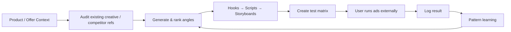

# GGC Creative — Mobile PRD v1

**Product:** GGC Creative  
**Positioning:** AI Performance Creative  
**Version:** 1.0  
**Target platform:** Mobile-first web app / Base44  
**Source capability:** FlowMedia AI  
**Status:** Build-ready PRD

---

# 1. Product definition

## One sentence

**GGC Creative tells a growth team what creative to test next — and turns that decision into hooks, scripts, storyboards and a measurable test matrix.**

## What it is not

- Not a generic AI image generator.
- Not “AI makes videos.”
- Not a social posting calendar.
- Not a Canva replacement.
- Not a full media-buying platform in v1.

## Primary job

> “I have a game, app or offer. Tell me which creative angle is worth testing, give me production-ready variants, and help me learn from the result.”

---

# 2. Target users

### Primary
- Game/App UA manager
- Creative strategist
- Growth manager
- Small studio founder
- Performance marketing agency

### Secondary
- Product marketer
- Indie publisher
- Content / creative lead

### User maturity
- Has something real to sell.
- Has existing ads or competitor references.
- Understands that creative performance requires testing.
- Does not want to spend hours writing briefs or organizing learning.

---

# 3. Product goals / success metrics

## Activation
A new user reaches the first useful output:
- 3 creative angles
- 5 hooks
- 1 script
- 1 test matrix

**Target: < 3 minutes from first brief submission.**

## Aha moment
User says: “I know exactly what to test next.”

## Core product metrics
- Brief → generated concepts conversion
- % briefs that create a test matrix
- concepts saved / exported
- test result return rate
- repeat weekly active users
- winning-angle reuse rate
- free → paid conversion
- paid → GGC Sprint escalation

---

# 4. Core loop

The product is valuable only if the learning loop closes. Generation without results is a content toy; generation + test learning is a performance product.

---

# 5. Mobile information architecture

## Bottom navigation

### 1. Ideas
Home and recommendation surface.

### 2. Library
Saved concepts, hooks, scripts, storyboards and assets.

### 3. Create
Primary center CTA.

### 4. Tests
Test matrix, status and result entry.

### 5. Insights
Pattern learning, winners, losers and recommended next tests.

---

# 6. Screen-by-screen PRD

## Screen A — First Run / Product Context

### Goal
Collect enough context without a long onboarding form.

### UI
Header:
- GGC Creative
- Workspace selector

Primary card:
**What are you trying to grow?**

Input options:
- Paste App Store / Google Play / Steam / website URL
- Upload screenshots
- Type product / offer in one sentence
- Optional voice input

Quick chips:
- Game
- App
- SaaS
- Ecommerce
- Other

Secondary:
**Who do you want to reach?**
- market
- audience
- target action: install / trial / purchase / wishlist / lead

CTA:
**Build My Creative Brief**

### Interaction
- URL paste attempts metadata extraction.
- If extraction fails, continue with manual input.
- Never block progress because a field is missing.
- Save context to Workspace.

### Exit criteria
Workspace has:
- product name
- category
- target audience
- target action
- primary market

---

## Screen B — Ideas / Home

### Goal
Answer: “What should I test?”

### Header
- product name
- last analysis date
- workspace switch

### Block 1 — Primary recommendation
**Test this next**

Shows:
- angle name
- reason
- evidence/source
- expected learning
- primary CTA: **Build Variants**

### Block 2 — Winning Angles
Top 3 cards:
- angle
- fit score
- source: own data / competitor / category pattern / AI hypothesis
- save / use

### Block 3 — Current Tests
- Running
- Waiting for result
- Winner found

### Block 4 — Recent learning
Example:
“UGC proof is outperforming feature-led creative in your last 3 tests.”

### Empty state
**No results yet. Start with your first creative brief.**

---

## Screen C — New Brief

### Goal
Create one bounded creative problem.

### Fields
- Objective: Install / Purchase / Wishlist / Lead / Other
- Product / feature / offer
- Audience
- Market
- Platform: Meta / TikTok / YouTube / Google / Other
- Format: video / static / playable concept / carousel
- Existing creative: upload up to 10
- Competitor refs: URLs / upload
- Constraint: duration / aspect ratio / language / brand restrictions

### Fast mode
Single text prompt + attachments.

### Advanced mode
Expandable fields above.

### CTA
**Analyze & Generate**

---

## Screen D — Creative Audit

### Goal
Explain why an existing creative may or may not work.

### Output cards
1. Hook strength
2. Clarity
3. Audience fit
4. Emotional angle
5. Proof / credibility
6. Visual hierarchy
7. CTA
8. Platform fit

Each card:
- score 0–100
- evidence
- issue
- fix

### Summary
- Keep
- Change
- Test

### CTA
**Turn Fixes Into New Variants**

---

## Screen E — Angle Generator

### Goal
Generate distinct strategies, not superficial copy variations.

Each angle card:
- Angle name
- Core emotion / motivation
- Audience
- Hook thesis
- Proof type
- Visual direction
- Risk
- Fit Score
- Why this angle

Default output:
- 5 angles
- system recommends Top 3

Actions:
- Select
- Save
- Regenerate one
- Combine two
- “More like this”

---

## Screen F — Hook Lab

### Goal
Create high-quality first-second / first-line hooks.

Tabs:
- Emotional
- UGC
- Problem
- Proof
- Curiosity
- Before → After
- Contrarian

Each hook:
- copy
- visual opening
- recommended format
- risk / overclaim flag

Actions:
- Favorite
- Edit
- Generate variations
- Send to Script

---

## Screen G — Script Builder

### Goal
Turn the selected angle + hook into a production-ready script.

Structure:
1. 0–2s Hook
2. 2–5s Context
3. 5–10s Demonstration / proof
4. 10–13s payoff
5. 13–15s CTA

Controls:
- duration
- platform
- tone
- UGC / polished / gameplay / testimonial / mixed
- language

Output:
- spoken copy
- on-screen text
- scene direction
- asset requirements
- sound / pace suggestion

CTA:
**Build Storyboard**

---

## Screen H — Storyboard / Production Pack

### Goal
Make the creative executable by a person or another generation tool.

Per frame:
- timestamp
- visual
- subject action
- camera
- on-screen text
- voice
- asset reference

Output tools:
- Generate reference image
- Generate asset prompt
- Export production brief
- Copy prompt

v1 rule:
**Image generation can be optional. Video rendering is not required for product completion.**

---

## Screen I — Test Matrix

### Goal
Make testing systematic.

Matrix dimensions:
- Angle
- Hook
- Format
- Visual
- CTA
- Audience / channel

Default:
3 concepts × 2 hook variants = 6 tests.

Each row:
- hypothesis
- variable changed
- success metric
- min sample / decision rule
- status

Actions:
- Save
- Duplicate
- Export CSV / share
- Mark Live

---

## Screen J — Test Result Entry

### Goal
Close the loop with minimal friction.

Input:
- Spend
- Impressions
- Clicks
- Installs / conversions
- Revenue optional
- CTR / CVR / CPI / CPA auto-calculated
- result: Win / Neutral / Lose
- note

Optional:
- upload screenshot
- paste Meta / TikTok export later in Phase 2

CTA:
**Save Learning**

---

## Screen K — Insights

### Goal
Turn past tests into reusable creative intelligence.

Sections:
- Winning angles
- Winning hooks
- Losing patterns
- Best formats
- Audience-specific patterns
- Platform-specific patterns

Primary recommendation:
**What to test next**

Evidence label:
- Own results
- Competitor observation
- Category pattern
- AI hypothesis

Never blend these source types without a label.

---

## Screen L — Library

Filters:
- Angle
- Hook
- Script
- Storyboard
- Asset
- Test
- Winner

Search:
- product
- market
- audience
- platform
- tag

Actions:
- reuse
- duplicate
- archive
- export

---

# 7. Data model

## Workspace
- id
- owner_id
- name
- company
- product_name
- product_url
- category
- audience
- market
- conversion_goal
- brand_rules

## CreativeBrief
- id
- workspace_id
- objective
- audience
- market
- platform
- format
- constraints
- source_urls
- uploaded_assets
- status

## CreativeAudit
- id
- brief_id
- asset_id
- hook_score
- clarity_score
- audience_fit_score
- proof_score
- visual_score
- cta_score
- platform_fit_score
- findings
- recommendations

## CreativeConcept
- id
- brief_id
- angle_name
- motivation
- thesis
- proof_type
- visual_direction
- fit_score
- evidence_type
- rationale
- status

## Hook
- id
- concept_id
- type
- copy
- visual_opening
- platform
- risk_flag
- selected

## Script
- id
- concept_id
- hook_id
- duration
- scenes
- voice_copy
- on_screen_copy
- cta

## Storyboard
- id
- script_id
- frames
- asset_prompts
- reference_assets

## TestPlan
- id
- workspace_id
- name
- hypothesis
- primary_metric
- decision_rule
- status

## TestVariant
- id
- test_plan_id
- concept_id
- hook_id
- format
- audience
- channel
- spend
- impressions
- clicks
- conversions
- revenue
- result

## CreativeLearning
- id
- workspace_id
- pattern_type
- pattern
- confidence
- evidence_count
- source_type

---

# 8. AI / system architecture

## Input layer
- URL metadata
- screenshots
- uploaded creative
- manual product context
- competitor references

## Analysis layer
- creative decomposition
- audience/offer interpretation
- category pattern retrieval
- claim/risk check
- scoring

## Generation layer
- angle generation
- hook generation
- script generation
- storyboard
- production prompts

## Planning layer
- test matrix
- hypothesis
- success metric
- decision rule

## Learning layer
- result ingestion
- pattern extraction
- recommendation update

---

# 9. FlowMedia AI reuse map

Current FlowMedia AI already demonstrates useful Base44 patterns:

### Reuse directly or port
- Base44 Core `InvokeLLM`
- `GenerateImage`
- generation progress / failure handling
- `GenerationJob` lifecycle
- content library/search patterns
- analytics + AI recommendation card
- multi-channel capability mapping
- asset / variant concepts

### Rewrite
- Bunny-specific `CharacterBrain`
- social-content-first homepage
- “Image / Video / Caption” creation taxonomy
- content calendar as primary workflow
- character-specific prompts
- publisher-first experience

### Replace with GGC Creative concepts
- Character → Workspace / Product
- Content Item → Creative Concept
- Content Variant → Creative Variant
- Bunny Analytics → Creative Learning
- Today’s Creation → What Should I Test?
- Platform adaptation → Test variant design

---

# 10. Mobile interaction specification

## Global
- 390px is primary QA width.
- Minimum tap target: 44px.
- One dominant CTA per page.
- No hover-dependent functionality.
- No required horizontal tables.
- Long output defaults to summary + expandable detail.
- Swipe may be used for save/archive but never as the only way to perform an action.

## Generation state
1. Analyze
2. Build strategy
3. Generate variants
4. Prepare test plan

Show visible progress and partial results where possible.

## Error state
Never dead-end.
Examples:
- URL extraction failed → manual context.
- image generation failed → retain strategy/text outputs.
- integration unavailable → export package.

---

# 11. FTUE

### Step 1
“What are you growing?”
Paste URL / upload / type.

### Step 2
“What is the conversion goal?”
Install / Purchase / Wishlist / Lead.

### Step 3
“Show me what you already have.”
Optional creative upload.

### Step 4
System returns:
- 3 recommended angles
- 5 hooks
- one example script
- one starter test matrix

Then account / save prompt.

**Do not require a long registration flow before demonstrating value if Base44 permissions allow a public-demo mode.**

---

# 12. Pricing / entitlement concept

### Free / Demo
- 1 workspace
- limited audit
- 3 angles
- 5 hooks
- starter test matrix
- watermark / limited exports

### Pro
- more briefs
- full scripts/storyboards
- libraries
- result logging
- insights
- exports

### Team
- multiple seats
- shared workspace
- approval
- team test library

### Upgrade to GGC Sprint
Trigger when:
- repeated weekly use
- enterprise email
- multi-seat intent
- large creative volume
- asks for UA / product / monetization diagnosis

---

# 13. Analytics events

- app_open
- onboarding_started
- workspace_created
- brief_started
- brief_completed
- audit_started
- audit_completed
- angle_generated
- angle_selected
- hook_saved
- script_generated
- storyboard_generated
- test_plan_created
- test_marked_live
- result_logged
- insight_viewed
- export_clicked
- upgrade_clicked
- sprint_lead_created

---

# 14. v1 acceptance criteria

## P0
- Mobile layout works at 390px with no horizontal overflow.
- User can create a workspace.
- User can create a brief.
- System produces angles, hooks, script and a test matrix.
- Results save to history/library.
- Test result can be logged.
- Insights page can use logged results.
- No Bunny-specific public copy remains.
- No fake integrations.

## P1
- Product URL ingestion.
- Creative upload + audit.
- Storyboard export.
- GenerateImage reference asset.
- Evidence labels.
- Shareable report / test plan.
- Beta / upgrade CTA carries `product=creative&source=app&intent=upgrade`.

---

# 15. Base44 implementation checkpoints

### C0 — Snapshot
Create checkpoint of FlowMedia AI before any source extraction.

### C1 — GGC Creative app shell
- mobile header
- bottom nav
- design tokens
- empty states

### C2 — Workspace + Brief
- Workspace entity
- CreativeBrief entity
- FTUE

### C3 — Generate
- CreativeConcept
- Hook
- Script
- Storyboard
- InvokeLLM orchestration

### C4 — Test
- TestPlan
- TestVariant
- result entry

### C5 — Learn
- CreativeLearning
- Insights
- next-test recommendation

### C6 — QA
- 390 / 430 / 768 widths
- empty / loading / failure states
- auth
- persistence
- bilingual copy where required

### C7 — Public beta
- separate public app URL
- website CTA
- source/intent tracking
- upgrade path

---

# 16. First demo scope

The first demo is considered complete when a user can:

1. enter a product / URL
2. choose a growth objective
3. upload or skip existing creatives
4. receive 3 ranked angles
5. open one angle
6. choose a hook
7. generate a 15-second script
8. see a storyboard
9. create a 6-cell test matrix
10. save it
11. enter one test result
12. see one updated recommendation

That is the minimum end-to-end loop. Anything beyond it is secondary for the first Base44 demo.